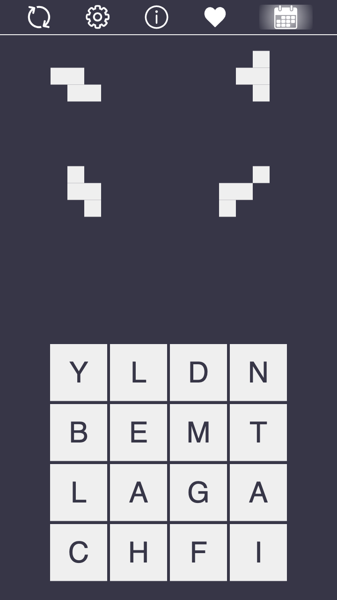

# Blobble

A spatial word game.

**Players:** 1

**Time:** 5 minutes

[Play Now!](https://skedwards88.github.io/blobble/)

Do you have feedback or ideas for improvement? [Open an issue](https://github.com/skedwards88/blobble/issues/new).

Want more games? [Check these out](https://skedwards88.github.io/).

Want more games? Check out [Crossjig](https://crossjig.com) and [Lexlet](https://lexlet.com) or see all of my puzzle games [here](https://skedwards88.github.io/).

## Development

To build, run `npm run build`. (Run `npm install` first if you haven't already.)

To run locally with live reloading and no service worker, run `npm run dev`. (If a service worker was previously registered, you can unregister it in chrome developer tools: `Application` > `Service workers` > `Unregister`.)

To run locally and register the service worker, run `npm start`.

To deploy, push to `main` or manually trigger the GitHub Actions `deploy.yml` workflow.
